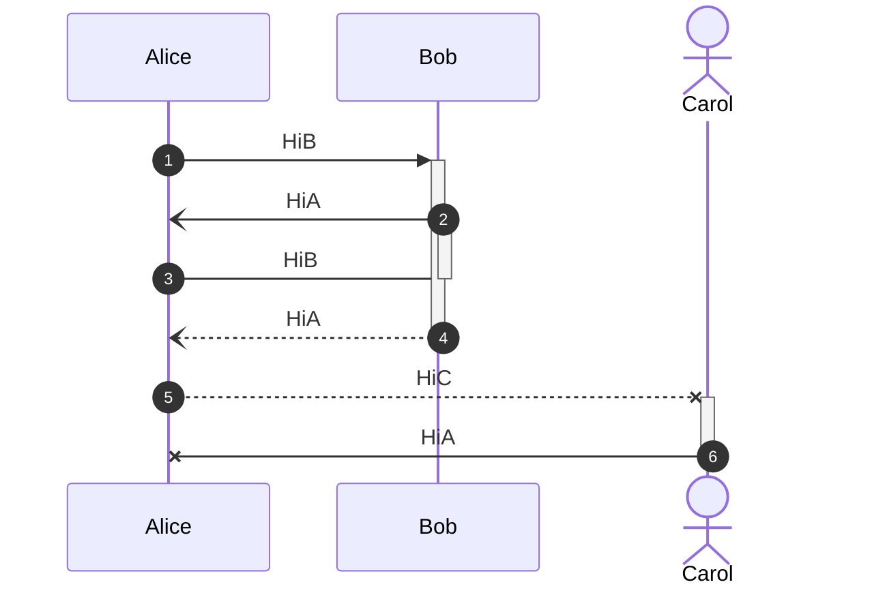
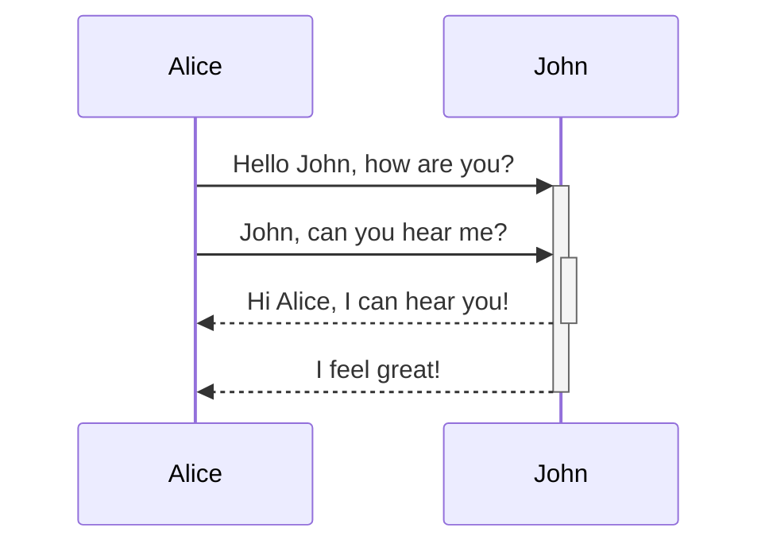
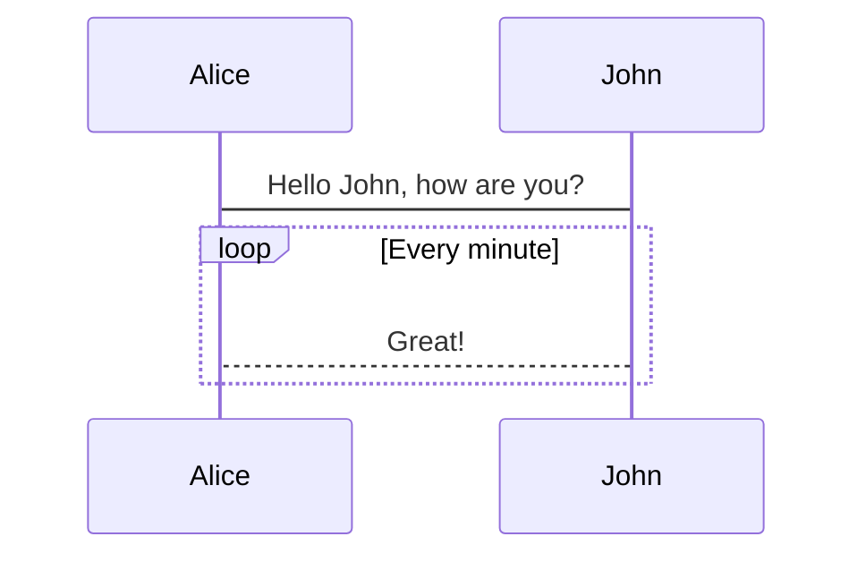
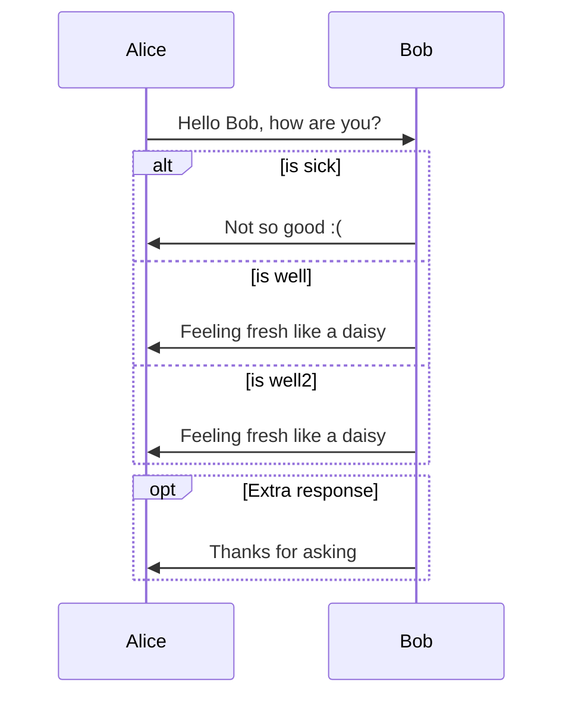
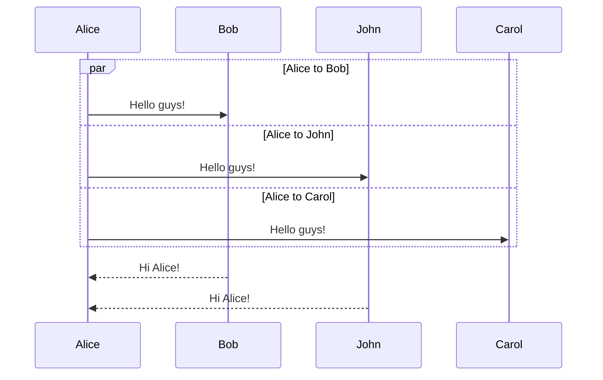
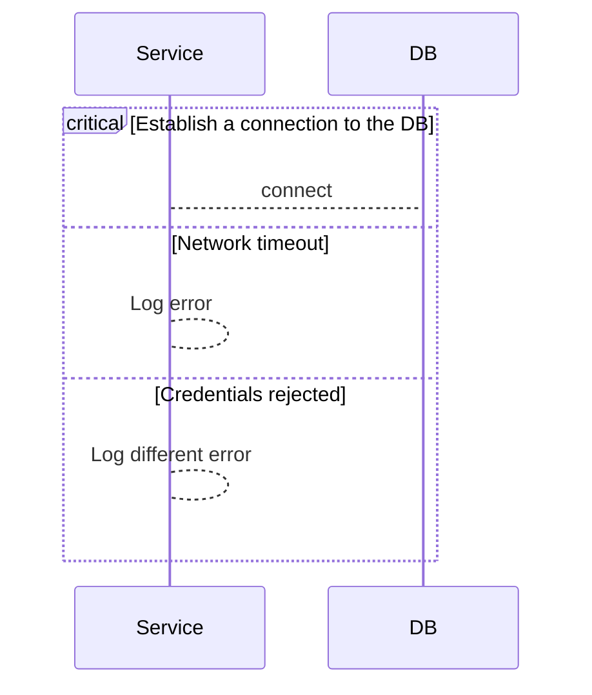
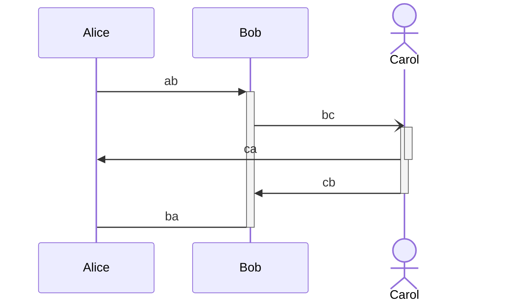

[Sequence diagrams](https://mermaid.js.org/syntax/sequenceDiagram.html)

基本结构
- 线, 可以指向自己
    - `a -> b:` 无箭头实线 
    - `a --> b` 无箭头虚线
    - `a ->> b: ` 实线箭头
    - `a -->> b: ` 虚线箭头
    - `a -) b: ` 实线空心箭头
    - `a --) b:` 虚线空心箭头
    - `a -x b: ` 实线 x 形箭头
    - `a --x b: ` 虚线 x 形箭头
- 线相关描述(必须存在一个描述)
    - `: xxx` 在线上进行描述
- Activations
    - 可以通过 `activate <participant name>`和 `deactivate <participant name>`联合成一组
        - 组合方案是和最近的一个 participant name 进行关联
    - 可以通过在线上末端加上 "`+`" 和 "`-`" 来进行快展示
    - 整体采用 FIFO 进行组合
        - 整个操作可以理解成在对应 actor 下有一个对应的队列, 可以不断的进行入栈和出栈.
- 参与者
    - `participant A` 以方块表示参与者
    - `actor A` 以小人表示参与者
    - `actor A as Alice` 对 A 起一个展示用的别名
- 循环
    - loop 循环框
    - alt/else/end 可以在序列图中表达替代路径
    - par/and/end 可以显示并行发生的动作
    - critical/option/end 可以通过对情况进行条件处理来显示必须自动发生的操作
- 其他
    - autonumber 可以提供序号

## 一些简单表示

