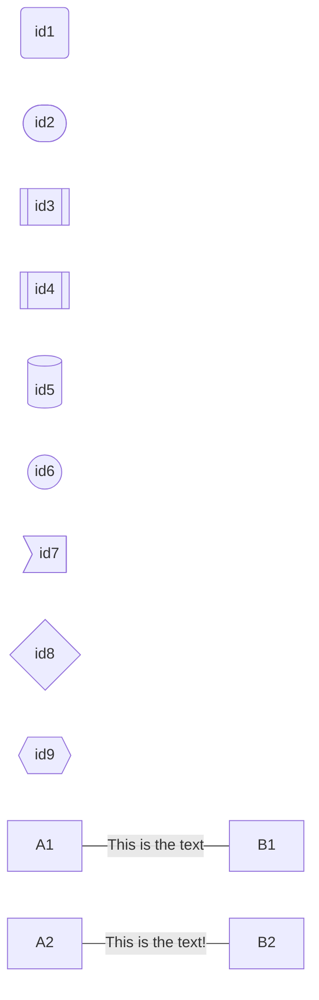
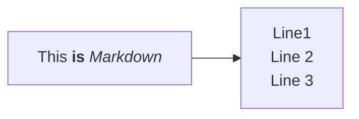
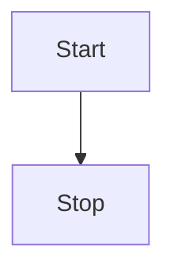
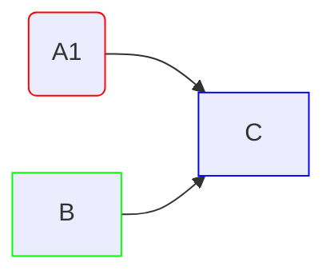
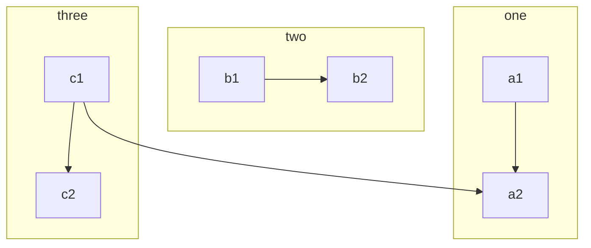
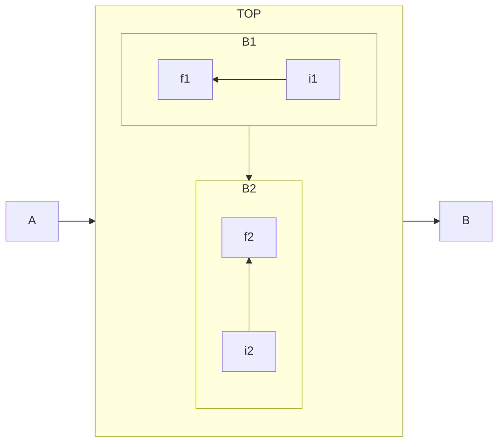

[Flowcharts Syntax | Mermaid](https://mermaid.js.org/syntax/flowchart.html)

```mermaid
flowchart LR
    id1(id1)
    id2([id2])
    id3[[id3]]
    id4[[id4]]
    id5[(id5)]
    id6((id6))
    id7>id7]
    id8{id8}
    id9{{id9}}
    A1---|This is the text|B1
    A2-- This is the text! ---B2
```

```mermaid
flowchart LR
    markdown["`This **is** _Markdown_`"]
    newLines["`Line1
    Line 2
    Line 3`"]
    markdown --> newLines
```

```mermaid
flowchart TD
    Start --> Stop
```

```mermaid
flowchart TD
    Start --> Stop
```

```mermaid
flowchart LR
    A(A1):::foo & B:::bar --> C:::foobar
    classDef foo stroke:#f00
    classDef bar stroke:#0f0
    classDef foobar stroke:#00f
```

```mermaid
flowchart TB
    c1-->a2
    subgraph one
    a1-->a2
    end
    subgraph two
    b1-->b2
    end
    subgraph three
    c1-->c2
    end
```

```mermaid
flowchart LR
  subgraph TOP
    direction TB
    subgraph B1
        direction RL
        i1 -->f1
    end
    subgraph B2
        direction BT
        i2 -->f2
    end
  end
  A --> TOP --> B
  B1 --> B2
```
